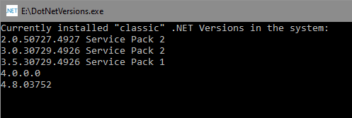

DotNetVersions
===

There's no simple built in way to see the currently installed versions of the "classic" .NET platform in a system. The only way is to go to the system's registry and search and analyze some keys and values, as described in the [documentation](https://docs.microsoft.com/en-us/dotnet/framework/migration-guide/how-to-determine-which-versions-are-installed).

This simple and straight-forward command-line tool shows all the available versions in your system.

When running the tool, by default, it shows some informational text at the beginning:



This is useful for informational purposes, but if for any reason you need to run it in a batch file and you want to get just the versions without any additional text, you can use any of the following arguments: `/b`, `-b` or `--b`

```bash
dotnetversions -b
```

You can get some quick help by using the `/?`, `-?`, `--?`, `/help`, `-help`, or `--help` switch.
